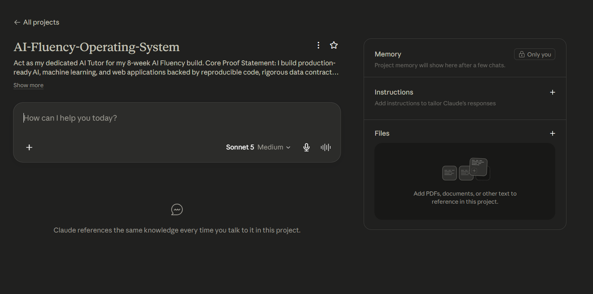

# FL-01: Setup & Workflow Audit

## 1. Weekly Workflow Audit (11 Real Tasks)

| #     | Task Description                                                   | Classification           | One-Line Rationale                                                                                |
| :---- | :----------------------------------------------------------------- | :----------------------- | :------------------------------------------------------------------------------------------------ |
| **1** | Writing custom loss functions & architecture layers in PyTorch      | **Collaborate with AI**  | Accelerates boilerplate code generation while I maintain full logic control.                      |
| **2** | Validating bioinformatics pipeline outputs & gene matrix alignments | **Just Me**              | High risk of hallucination on biological edge cases; absolute accuracy requires human validation. |
| **3** | Technical paper summary & literature synthesis                     | **Delegate with Review** | AI distills key methods and findings quickly, which I then verify against original figures.       |
| **4** | Frontend component styling & 3D WebGL scene setups                  | **Collaborate with AI**  | Speeds up routine CSS/Three.js layout code while I tweak creative layout and shaders.             |
| **5** | Analyzing Forex & Gold intraday price action charts                 | **Just Me**              | Trading relies on real-time market intuition and risk management where AI models lag or overfit.  |
| **6** | Drafting GitHub PR descriptions and documentation                  | **Delegate with Review** | AI turns inline code comments and git diffs into clean, structured Markdown summaries.            |
| **7** | Debugging complex Python tracebacks & environment conflicts        | **Collaborate with AI**  | AI acts as a fast rubber-duck debugger to pinpoint syntax or dependency issues.                   |
| **8** | Automated daily news aggregation for market events                 | **Fully Automate**       | Simple script-based retrieval of economic calendars and news feeds without manual intervention.   |
| **9** | Drafting emails and communication for academic/project guides      | **Delegate with Review** | AI polishes tone and structure, but I adjust specific context before sending.                     |
| **10**| Planning weekly study schedules & project sprint goals             | **Collaborate with AI**  | AI helps break down broad milestones into daily task blocks that I adjust to match my energy.     |
| **11**| Reviewing model evaluation metrics (ROC-AUC, F1) against baselines | **Just Me**              | Final assessment of clinical/biological model reliability demands pure human domain judgment.     |

---

## 2. Target Tasks & Success Definitions

### Task 1: Research & Literature Synthesis
- **Target Task:** Extracting methodology, dataset parameters, and benchmark results from research papers.
- **Definition of "Done Well":** Generates an accurate 1-page structured summary table (Dataset, Model Architecture, Metrics, Limitations) with zero hallucinated numbers, verified against the source text in under 15 minutes.

### Task 2: Code Debugging & Refactoring
- **Target Task:** Resolving complex Python/Jupyter memory errors and array shape mismatches in data pipelines.
- **Definition of "Done Well":** Identifies the root cause of the bug, provides a functional fix that runs cleanly without breaking upstream code, and includes an explanation of _why_ the bug occurred.

### Task 3: Technical Documentation & README Generation
- **Target Task:** Creating production-ready `README.md` files for GitHub repositories from codebase files.
- **Definition of "Done Well":** Produces a clean, developer-friendly guide containing architecture diagrams, quick-start installation steps, and API endpoint descriptions that allow a peer to run the project locally without asking questions.

---

## 3. Proof of Tooling Setup

### Claude Project Configuration

### Anthropic Academy Enrollment

---

## 4. Minimal Sitemap & AI Tutor Pressure-Test

### Sitemap Structure
- **Hero / Claim:** Clear statement of value paired with a primary CTA.
- **Case Studies / Work:** Key projects providing proof and technical evidence.
- **About:** Embedded summary of background, credentials, and technical focus.
- **Contact:** Global primary call-to-action (Consultation Booking).

### Claude Pressure-Test Critique & Revisions
- **Key Critique:** Forcing Contact as a standalone 4th page adds friction for users who don't browse linearly. Separate About pages can add unnecessary clicks without adding conversion value.
- **Actionable Revision Made:** Replaced the multi-page linear path with a single scrolling layout (or persistent CTA in header/footer) so potential leads can convert from any section immediately.